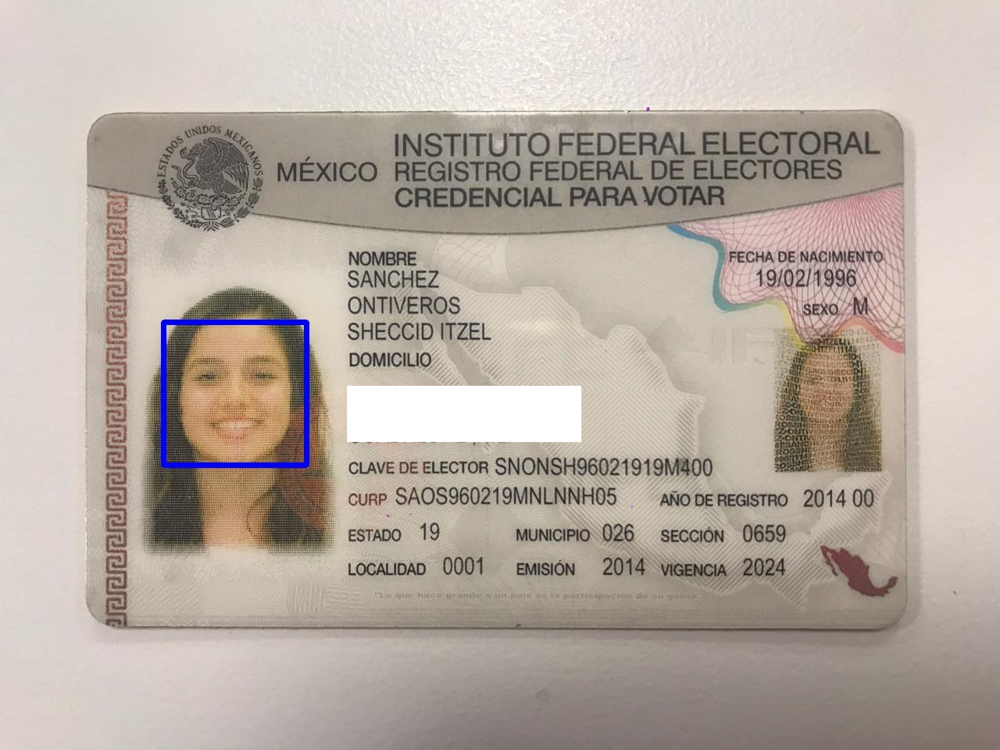

# Accenture Challenge - Semana i 2019
Proyecto de Inteligencia Artificial y Visión computacional para resolver la situación del estacionamiento de alguna universidad.

## Índice
- [Accenture Challenge - Semana i 2019](#accenture-challenge---semana-i-2019)
  - [Índice](#%c3%8dndice)
    - [Solución](#soluci%c3%b3n)
    - [Contenido](#contenido)
      - [Vehículos y placas](#veh%c3%adculos-y-placas)
      - [Caras](#caras)
    - [Estacionamiento](#estacionamiento)
    - [Nuestra presentación](#nuestra-presentaci%c3%b3n)
    - [Equipo](#equipo)

### Solución
**DATECH**: Sistema de monitoreo de estacionamientos universitarios, que supervisa la ocupación real de un estacionamiento, guiando a los conductores hasta un lugar vacío.

Nuestra solución consiste en la detección de la entrada de carros, detectando el color de este, sus placas, así como la toma de la imagen de la identificación del conductor.

### Contenido
* [my-app](https://github.com/DanielSGA/accenture-challenge/tree/master/my-app): contiene lo relacionado con la web app desarrollada en react para mostrar una aplicación de búsqueda de placas con información del carro y su dueño.
* [face-detection](https://github.com/DanielSGA/accenture-challenge/tree/master/face-detection): contiene el código para la detección de cara de una identificación que a la vez almacena.
* [mask-rcnn](https://github.com/DanielSGA/accenture-challenge/tree/master/mask-rcnn): contiene el código de la detección de carros, su color y placa.

#### Vehículos y placas
Cuando un vehículo va ingresando al estacionamiento, una cámara que graba, detecta que lo que se aproxima es un carro, detecta su color y toma una foto de la placa.

Al tener una fotografía de la placa, se detecta el texto y se guardan las imágenes de cada carro con el nombre de su placa correspondiente.

#### Caras
Utilizando OPENCV en Python, se toman las fotografías para luego tomar el lado izquierdo de esta imagen y detectarla mediante Haarcascade.

comando para correr el código: `$python3 detect-crop-face.py`
### Estacionamiento
Otro aspecto que contemplaba nuestra solución era la detección de aquellos espacios disponibles del estacionamiento para así, darle al usuario que ingresaba aquél lugar disponible para que se estacionara.

### [Nuestra presentación](https://docs.google.com/presentation/d/1nrXZRckH4xwWrsvsja_tJlGaxderF1o0M95yK9Fo_l4/edit?usp=sharing)

### Equipo
* Jorge García A00516604 (IMT)
* Sheccid Itzel Sánchez A01196302 (I2D)
* Daniel Saldaña A00818923 (ITC)
* Flor Esthela Barbosa A01281460 (ITC)